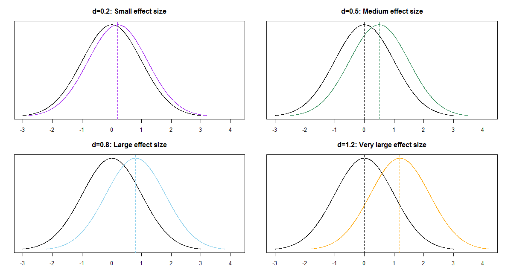

# Comparing Two Means {#sec-comparing-two-means}



<!--  -->


- Most interesting statistical problems involve multiple measured variables.
For example, many problems involve comparing two (or more) populations or groups based on two (or more) samples.
- In such situations, each population or group will have its own parameters, and there will often be dependence between parameters.
We are often interested in difference or ratios of parameters between groups.


::: {#exm-babysmoke}
Do newborns born to mothers who smoke tend to weigh less at birth than newborns from mothers who don't smoke?
We'll investigate this question using birthweight (pounds) data on a sample of full term births in North Carolina over a one year period.

Assume birthweights follow a conditional Normal distribution with mean $\mu_1$ for nonsmokers and mean $\mu_2$ for smokers, and standard deviation $\sigma$.

Note: our primary goal will be to compare the means $\mu_1$ and $\mu_2$.
We're assuming a common standard deviation $\sigma$ to simplify a little, but we could (and probably should) also let standard deviation vary by smoking status.
(We could also assume something other than conditional Normal, but again, we're simplifying.)
:::


1. Suggest a prior distribution.
\
\
\
\
\

1. The prior distribution will be a joint distribution on $(\mu_1, \mu_2, \sigma)$ triples.
We could assume a prior under which $\mu_1$ and $\mu_2$ are independent.
But why might we want to assume some prior *dependence* between $\mu_1$ and $\mu_2$?
(For some motivation it might help to consider what the frequentist null hypothesis would be.)
\
\
\
\
\

1. Regardless of your answers to the previous parts, assume for the prior: $\mu_1, \mu_2, \sigma$ are independent; each of $\mu_1, \mu_2$ has a Normal(7.5, 0.5) distribution; $\sigma$ has a Half-Normal(0, 1) distribution.
How do you interpret the parameter $\mu_1 - \mu_2$?
Plot the prior distribution of $\mu_1-\mu_2$, and find prior central 50%, 80%, and 98% credible intervals.
Also compute the prior probability that $\mu_1-\mu_2>0$.
\
\
\
\
\

1. Briefly describe the sample data, summarized in @sec-babysmoke-data.
\
\
\
\
\


    
1. Is it reasonable to assume that the two *samples* are independent?
(In this case the $y_1$ and $y_2$ samples would be *conditionally independent* given $(\mu_1, \mu_2, \sigma)$.)
\
\
\
\
\

1. Describe how you would compute the likelihood.
For concreteness, how you would you compute the likelihood if there were only 4 babies in the sample: 2 non-smokers with birthweights of 8 pounds and 7 pounds, and 2 smokers with birthweights of 8.3 pounds and 7.1 pounds. 
\
\
\
\
\

1. Use `brms` to approximate the posterior distribution.
Are $\mu_1$ and $\mu_2$ independent according the posterior?
Why do you think that is?
\
\
\
\
\

1. Plot the posterior distribution of $\mu_1-\mu_2$ and describe it.
Compute and interpret posterior central 50%, 80%, and 98% credible intervals.
Also compute and interpret the posterior probability that $\mu_1-\mu_2>0$.
\
\
\
\
\

1. If we're interested in $\mu_1-\mu_2$, why didn't we put a prior directly on $\mu_1-\mu_2$ rather than on $(\mu_1,\mu_2)$?
\
\
\
\
\

1. Plot the posterior distribution of $\mu_1/\mu_2$, describe it, and find and interpret posterior central 50%, 80%, and 98% credible intervals.
\
\
\
\
\

1. Is there some evidence that babies whose mothers smoke tend to weigh less than those whose mothers don't smoke?
\
\
\
\
\

1. Can we say that smoking is the cause of the difference in mean weights?
\
\
\
\
\


1. Is there some evidence that babies whose mothers smoke tend to weigh *much* less than those whose mothers don't smoke?
Explain.
\
\
\
\
\

1. One quantity of interest is the **effect size**, which is a way of measuring the magnitude of the difference between groups.  When comparing two means, a simple measure of effect size (*Cohen's $d$*) is
$$
\frac{\mu_1 - \mu_2}{\sigma}
$$
Plot the posterior distribution of this effect size and describe it.
Compute and interpret posterior central 50%, 80%, and 98% credible intervals.
\
\
\
\
\


**Independence in the data versus in the prior/posterior**

It is typical to assume *independence in the data*, e.g., independence of values of the measured variables within and between samples (conditional on the parameters).
Whether independence in the data is a reasonable assumption depends on how the data is collected.

But whether it is reasonable to assume prior *independence of parameters* is a completely separate question and is dependent upon our subjective beliefs about any relationships between parameters.

**Transformations of parameters**

The primary output of a Bayesian data analysis is the full joint posterior distribution on all parameters.
Given the joint distribution, the distribution of transformations of the primary parameters is readily obtained.


**Effect size for comparing means**

When comparing groups, a more important question than "is there a difference?" is "*how large* is the difference?"
An **effect size** is a measure of the magnitude of a difference between groups.
A difference in parameters can be used to measure the absolute size of the difference in the measurement units of the variable, but effect size can also be measured as a relative difference.

When comparing a numerical variable between two groups, one measure of the population effect size is **Cohens's $d$**
$$
\frac{\mu_1 - \mu_2}{\sigma}
$$

The values of any numerical variable vary naturally from unit to unit.
The SD of the numerical variable measures the degree to which individual values of the variable vary naturally, so the SD provides a natural "scale" for the variable.
Cohen's $d$ compares the magnitude of the difference in means relative to the natural scale (SD) for the variable.


Some rough guidelines for interpreting $|d|$:

|             |       |        |       |            |      |
|------------:|------:|-------:|------:|-----------:|-----:|
|         *d* |   0.2 |    0.5 |   0.8 |        1.2 |  2.0 |
| Effect size | Small | Medium | Large | Very Large | Huge |
|             |       |        |       |            |      |

For example, assume the two population distributions are Normal and the two population standard deviations are equal. Then when the effect size is 1.0 the median of the distribution with the higher mean is the 84th percentile of the distribution with the lower mean, which is a very large difference.

|                                    |       |        |       |      |            |      |
|:-----------------------------------|:-----:|:------:|:-----:|:----:|:----------:|:----:|
| *d*                                |  0.2  |  0.5   |  0.8  | 1.0  |    1.2     | 2.0  |
| Effect size                        | Small | Medium | Large |      | Very Large | Huge |
| Median of population 1 is          |       |        |       |      |            |      |
| (blank) percentile of population 2 | 58th  |  69th  | 79th  | 84th |    89th    | 98th |


```{r}
#| echo: false



```


## Notes

### Prior distribution of $\mu_1-\mu_2$

The prior distribution of $\mu_1-\mu_2$ is Normal with mean 7.5-7.5 = 0 and standard deviation $\sqrt{0.5^2 + 0.5^2} = 0.707$

```{r}

qnorm(c(0.01, 0.10, 0.25, 0.75, 0.90, 0.99),
      mean = 7.5 - 7.5,
      sd = sqrt(0.5 ^ 2 + 0.5 ^ 2))
```


### Sample data {#sec-babysmoke-data}


```{r}
data = read_csv("baby_smoke.csv")

head(data)
```

We'll only include full term babies in the analysis.
The variables of interest are `weight` and `habit`.

```{r}
data = data |>
  filter(premie == "full term")
```


```{r}
data |>
  group_by(habit) |>
  summarize(n(), mean(weight), sd(weight)) |>
  kbl(digits = 2) |>
  kable_styling()

```


```{r}
#| layout-ncol: 2

ggplot(data,
       aes(x = weight,
           fill = habit)) + 
   geom_histogram(alpha = 0.3,
              aes(y = after_stat(density)),
              position = 'identity')

ggplot(data,
       aes(x = weight,
           y = habit,
           col = habit)) + 
   geom_boxplot()


```

### Posterior distribution


```{r}
library(brms)
library(tidybayes)
library(bayesplot)
```

We want a posterior for $\mu_1$ and $\mu_2$, so we set the intercept to 0 in the linear model.
We can use `get_prior` with out model specifications to see what the parameters will be.

```{r}
get_prior(data = data,
           family = gaussian(),
           weight ~ 0 + habit)
```

Now we fit the model.
The `normal(7.5, 0.5)` prior for $\mu_1$ and $\mu_2$ will be vectorized.

```{r}
fit <- brm(data = data,
           family = gaussian(),
           weight ~ 0 + habit,
           prior = c(prior(normal(7.5, 0.5), class = b),
                     prior(normal(0, 1), class = sigma)),
           iter = 3500,
           warmup = 1000,
           chains = 4,
           refresh = 0)
```


```{r}
prior_summary(fit)
```


```{r}
summary(fit)
```


```{r}
plot(fit)
```


```{r}
pairs(fit,
      off_diag_args = list(alpha = 0.1))
```


```{r}
posterior = fit |>
  spread_draws(b_habitsmoker, b_habitnonsmoker, sigma) |>
  rename(mu1 = b_habitnonsmoker, mu2 = b_habitsmoker)

posterior |> head() |> kbl(digits = 2) |> kable_styling()
```


### Posterior distribution of difference in means

```{r}
posterior = posterior |>
  mutate(mu_diff = mu1 - mu2)

posterior |> head() |> kbl(digits = 2) |> kable_styling()
```


```{r}
ggplot(posterior,
       aes(x = mu_diff)) +
  geom_histogram(aes(y = after_stat(density)),
                 col = bayes_col["posterior"], fill = "white", bins = 100) +
  geom_density(linewidth = 1, col = bayes_col["posterior"]) +
  labs(x = "Difference in means (pounds)") +
  theme_bw()
```


```{r}

mean(posterior$mu_diff)

sd(posterior$mu_diff)

quantile(posterior$mu_diff,
         c(0.01, 0.10, 0.25, 0.5, 0.75, 0.90, 0.99))

sum(posterior$mu_diff > 0) / length(posterior$mu_diff)
```


### Posterior distribution of ratio of means


```{r}
posterior = posterior |>
  mutate(mu_ratio = mu1 / mu2)

posterior |> head() |> kbl(digits = 2) |> kable_styling()
```


```{r}
ggplot(posterior,
       aes(x = mu_ratio)) +
  geom_histogram(aes(y = after_stat(density)),
                 col = bayes_col["posterior"], fill = "white", bins = 100) +
  geom_density(linewidth = 1, col = bayes_col["posterior"]) +
  labs(x = "Ratio of means") +
  theme_bw()
```


```{r}

mean(posterior$mu_ratio)

sd(posterior$mu_ratio)

quantile(posterior$mu_ratio,
         c(0.01, 0.10, 0.25, 0.5, 0.75, 0.90, 0.99))
```


### Posterior distribution of effect size


```{r}
posterior = posterior |>
  mutate(effect_size = (mu1 - mu2) / sigma)

posterior |> head() |> kbl(digits = 2) |> kable_styling()
```


```{r}
ggplot(posterior,
       aes(x = effect_size)) +
  geom_histogram(aes(y = after_stat(density)),
                 col = bayes_col["posterior"], fill = "white", bins = 100) +
  geom_density(linewidth = 1, col = bayes_col["posterior"]) +
  labs(x = "Effect size") +
  theme_bw()
```


```{r}

mean(posterior$effect_size)

sd(posterior$effect_size)

quantile(posterior$effect_size,
         c(0.01, 0.10, 0.25, 0.5, 0.75, 0.90, 0.99))
```


